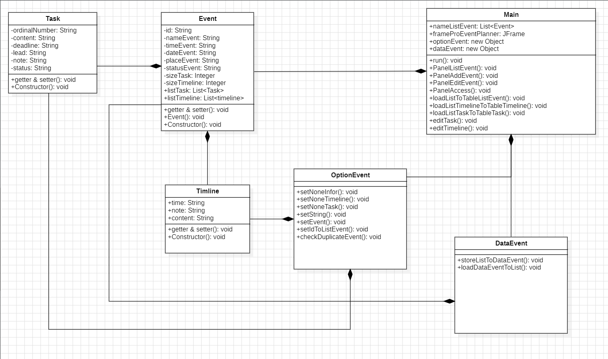

### 💡Ứng dụng tổ chức sự kiện: ProEventPlanner
🤜 Ứng dụng tổ chức sự kiện: ProEventPlanner là 1 ứng dụng cho phép người dùng quản lý các sự kiện. Ứng dụng cho phép: 

### Authors
[@TanaKeKe](https://github.com/TanaKeKe)
### 📷Screenshots


### Features
- Thêm - sửa - xoá sự kiện mới, cập nhật tiến độ sự kiện.
- Thêm timeline cho 1 sự kiện, chỉnh được mốc thời gian nào làm gì.
- Thêm các đầu việc cho sự kiện bao gồm nội dung đầu công việc, deadline, lead, note, trạng thái (done,pending).
- Tất cả dữ liệu sẽ được lưu vào file nên không sợ mất dữ liệu nha.
### Requirements

- Soure format: JDK 17
- Profile: Full JRE
- Encoding: UTF-8
### 📽️Video
[Ứng dụng tổ chức sự kiện: ProEventPlanner](https://www.youtube.com/watch?v=moF1qCVkiLs)
### 🚧UML

### Installation
```java
- Clone dự án trên.
- mở folder dist -> chạy file ProEventPlanner.jar
```